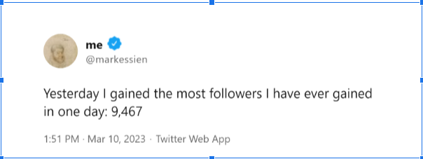

# DevRel Bible: How to sell to developers

> The only magic to take your [DevRel](https://blog.deepgram.com/what-is-devrel-a-deepgram-approach/) skills to the next level. Well structured skills and experience to get started in [Developer Relations](https://en.wikipedia.org/wiki/Developer_relations) or take your DevRel skills to the next level no matter your current skill level. Now, let's get started!
## Prerequisites

You only need to be curious to learn more about Developer Relations (DevRel).

## Table of contents

- [DevRel Bible: How to sell to developers](#DevRel-Bible-How-to-sell-to-developers)
  - [Prerequisites](#prerequisites)
  - [Table of contents](#table-of-contents)
  - [How to read this content](#how-to-read-this-content)
  - [Background](#background)
  - [Why is it hard to sell to developers?](#why-is-it-hard-to-sell-to-developers?)
  - [What is Developer Relations (DevRel)](#what-is-devrel?)
  - [What is the job of DevRel?](#what-is-the-job-of-devrel?)
  - [How to make developers buy](#how-to-make-developers-buy)
  - [How to make us feel the magic](#how-to-make-us-feel-the-magic)
    - [Identification of audience](#identification-of-audience)
    - [Education of stakeholders](#education-of-stakeholders)
    - [Forming Relationships the right way:
](#formimg-relationships-the-right-way)
      - [Naming things to elicit curiosity](#naming-things-to-elicit-curiosity)
      - [Crafting compelling titles](#crafting-compelling-titles)
      - [Making Content Intriguing](#making-content-intriguing)
  - [How to align business goals with DevRel
](#how-to-align-business-goals-with-devrel)
    - [Measuring the impact of going to conferences](#measuring-the-impact-of-going-to-conferences)
    - [Measuring the impact of creating content](#measuring-the-impact-of-creating-content)
    - [Measuring impacts of engaging developer communities](#measuring-impacts-of-engaging-developer-communities)
  - [More thought on creating swags to engage developers](#more-thought-on-creating-swags-to-engage-developers)
  - [How to measure success in Developer Relations (DevRel)](#how-to-measure-success-in-devrel)
    - [How to measure impacts?](#how-to-measure-impacts?)
    - [Stages of Impact](#stages-of-impact)
    - [How to measure impact quantitatively and qualitatively](#how-to-measure-impact-quantitatively-and-qualitatively)
      - [Progressive Reactions](#progressive-reactions)
      - [Retrogressive Reactions](#retrogressive-reactions)
      - [Precautionary Reactions](#precautionary-reactions)
      - [Predetermined Reactions](#predetermined-reactions)
  - [Hierarchy of reactions/engagements](#hierarchy-of-reactions-engagements)
  - [Measuring success](#measuring-success)
  - [Offers](#offers)
    - [For a business](#for-a-business)
    - [For an individual](#for-an-individual)
  - [Ayobami Ogundiran (Twitter: @codingnninja)](#ayobami-ogundiran)
  - [License](#license)

## How to read this content

Read everything on this page to have a general understanding of how to succeed in Developer Relations (DevRel) as a whole. However, you can click on "learn more..." at the end of a topic to go deeper into that particular topic.

## Background

It all started on February 6th, 2020 when I was sitting at my table researching more about DevRel challenges.

Although I had been dabbling into developer relations (DevRel) before then, the talk I had to give at a conference led me to serious research about developer relations.

Along the line, I kept seeing phrases like “It is hard to sell to developers”, “Don’t sell to developers” and so on. 

As a person who is into business and also a software developer, I kept asking myself, why is it hard to sell to us? Are we not human beings like every other person? 

So, I started researching how to sell to developers and I found interesting things I am about to share with you in this write-up.

[Learn more...](Developer%20Relations/1.%20General%20Developer%20Relations/0.%20Introducation.md)

## Why is it hard to sell to developers?

Selling to developers is very hard for four major reasons – openness, reliability, stubbornness and curiosity – all of which revolve around the practicality of software development. 

Developers are the best among the smart, they are very open and highly curious. At first, these reasons may seem odd but you will realize the truth in them soon.

Listen, salespeople tend to be tricky or deceiving in selling but the common ethic of most software developers is openness and it is that openness that makes it easy for us to share challenges, experiences and even our faults in public. You would agree with me on this if you’re a developer.

Or have you seen any community that shares things that should be secrets in public like software developers? Now, how is openness makes it hard to sell to developers? Psychologically speaking, if you’re open, you have a high tendency to dislike those who are not straightforward, isn’t it?

Also, developers are very smart people. Many of us have learned about human psychology and selling by reading widely and watching documentaries and movies. 

All of this experience plus our encounters with salespeople make us always assume salespeople want to trick us and no human being likes to be tricked. For that reason, we hate to give sellers our attention.

Developers are amazingly stubborn in pursuit, so we’re always strongly opinionated. Why do you think we have JavaScript libraries and frameworks that do the same thing basically? 

Why do you think we have DRY, WET and YAGNI? We tend to be stubborn in our thinking or belief and if you don’t have an emotionally and logically convincing product, you will struggle to sell to developers.

Our inherent curiosity makes it very hard to sell software to us and retain us. Many of us are okay with wasting our time and night to build or find out how one shining project works. In short, we like to learn and build our things. 

Are you even a software developer if you don’t have unfinished side projects? Who doesn’t? 

So you can’t easily sell software products to us by telling or tricking us to buy them. We will rather build our alternative if you make us angry or trick us. And if your product is not really convincingly useful, curiosity will take us to the next shining things.

That is the reality.

Why do you think developers are open? It is because if we’re not, any piece of software will expose us with ease. Software exposes marketing gimmicks easily because developers have to go through some experience while using them and developers are highly skeptical of software they have not used practically.

So developers rarely pay for software without experiencing it judging from experience. All this is why using marketing gimmicks without good experience rarely works in selling to developers. 

And it is the responsibility of DevRel to make sure your products work and achieve their purposes. They need to work to make sure your users feel the magic in your products the first time they use them. 

If they don't, DevRel needs to keep providing information to the stakeholders, abstract or create documentation and other forms of content to make the right audience feel the magic in your products. 

"The great liability of the engineer compared to men of other professions is that his works are out in the open where all can see them. 

His acts, step by step, are in hard substance. He cannot bury his mistakes in the grave like the doctors. 

He cannot argue them into thin air or blame the judge like the lawyers. He cannot, like the architects, cover his failures with trees and vines. 

He cannot, like the politicians, screen his shortcomings by blaming his opponents and hoping the people will forget. 

The engineer simply cannot deny he did it. If his works do not work, he is damned." - Herbert Hoover, American engineer and politician

[Learn more...](Developer%20Relations/1.%20General%20Developer%20Relations/2.%20Why%20is%20it%20hard%20to%20sell%20to%20developers.md)

## What is DevRel?

Tracing the origin of Developer Relations, there is no generally accepted definition as everyone tries to define it with relative terms.

Now, let's make an attempt to give a definition that has potential to satisfy the needs of any DevRel team.

DevRel is the interaction among developers to drive and achieve individual and organizational interests through experience and demonstration.

This definition claims that experience and demonstration are necessary to achieve or forfeit a business, user and team's goals.

Experience has to do with the value or benefit users, organizations and other parties gain out of their interactions which could be through demonstration in the form of content, conferences, demos and any other mediums. 

In short, Developer Relations revolve around all demonstrations and their attendant experience.

For the sake of practical application, DevRel is about Development, Education ( with marketing and selling sense) and Customer care/support. Oh, sorry! I have forgotten we all hate the word "selling and marketing". Anyway, hear me out.

Marketing or selling is not inherently bad, it is the snake oil sellers that make it seem so. Hating marketing or selling is just like hating policing and the police just because thieves use guns. Is that reasonable?

Even if you only educate and form relationships, understanding ethical marketing and selling will help you identify the right audience, shape products to users' tastes, make and distribute content to them and lead them to buy your products.

I strongly believe DevRel is partly about making developers feel the magic in your products. If you and your target audience can't feel the magic (the core problem it solves) while using your products, you still have a lot to do. 

Hey wait, isn't DevRel just marketing in disguise? Well, let's talk about their difference.

[Learn more...](Developer%20Relations/1.%20General%20Developer%20Relations/1.%20What%20is%20Developer%20Relations%20(DevRel).md)

## DevRel vs Marketing: What is the difference?

In the early morning of May 3, 2023, I saw a controversial tweet claiming "DevRel is marketing in disguise".

Honestly, it is hard to reasonably debunk this claim. But it must be debunked to help business people not to make horrible choices.

Looking at the claim again, it has the potential to make business people assume they can treat DevRel and Marketing the same way.

No. That would be a terrible mistake for one major reason: Marketing is a profession of those who can talk while DevRel is a profession of those who can bring the talk to reality or do both.

This is what I mean:

It is one thing to promise your audience they will get all their desires plus extra but it is another thing to fulfil the promise.

Marketers have no strong reasons or incentives to care about whatever happens to the users they bring, they only need to bring users. So they always resort to promising "The Heaven and The Earth" just to meet a target.

And there is nothing wrong with that because it is the purpose of their job. In short, the mindset of a marketer is to bring in users by all means possible.

But no, DevRel people can't do the same because their job is more practical than emotional. You can't promise computers to bring solutions into existence.

It has to be practically done, bit by bit, with blood and sweat but never with just promises.

DevRel people and developers generally always face the consequences of any promises they make. They have to work hard to create docs, abstractions, presentations and many others just to fulfil the promises.

Treating DevRel people like marketers tends to prevent them from doing their job of finding and implementing ways to improve user experience to drive adoption and revenue. Turning them to marketers may look good if you focus on vanity metrics instead of what moves your business forward in the end.

Obviously, DevRel has a lot to do with marketing and selling but they have to be addressed differently because of the practicality of software and software development. Marketers win when they bring in users and so they have an incentive to over-promise. Yes, it is totally different for DevRel people. 

After bringing users, they still have to be part of the process to deliver on their promises. If they fail to deliver on their promises, users will have terrible experiences, product adoption will tank and revenue will plummet, leading to the failure of such a company.

So, it is reasonable for any business that deals with developers to make sure their DevRel team focuses on making the developer experience better than anyone else can deliver in their industries. The best way to do so; is not to treat DevRel people as marketers.

Now, in summary, the major difference between marketing and DevRel is:

- Marketers are fond of ***sweetening*** product promises because they don't face the consequences of their actions as they don't build the product which may lead to terrible user or developer experience and revenue. DevRel teams work hard to fulfill the promises made by marketers and business executives. 

- Marketers tend to protect the image of their companies by spreading good news while DevRel tends to protect the image of their companies by trying to improve user experience and satisfaction.

- Marketing focuses on getting acquiring users without necessarily caring about users' experience while DevRel focuses on relationships and other activities that improve users' experience.

- Marketers don't have to care about the feedback from their users because it has nothing to do with their job but any DevRel team needs to care about it because it will help to improve users' experience and satisfaction.

Marketing and DevRel are different in purpose and operation, though they have some intersections in approach. So, treating DevRel teams and operations like marketing is not a good thing for a business that focuses on developers.

Okay, wait! If marketing is different from Developer Relations, then what is the job of DevRel people? 

They educate stakeholders and create documentation, abstractions, applications and content that make the magic in their products felt so that you won’t need to trick people to buy your products.
## What is the job of DevRel?

Your job as a member of a DevRel team is to make developers want to buy whatever products you’re dealing with. 

Making them want to buy is a necessity because a relationship that doesn’t provide for business expectations is a failure. 

Think about it. 

How will businesses pay salaries if they’re not making revenue? Did you just say “venture funds"? But can “venture funds” last forever? If not, developers need to buy.

## How to make developers buy

“I’ve learned that people will forget what you said, people will forget what you did, but people will never forget how you make them feel” – Maya Angelou

What is your product making developers feel? That is what matters most.

Making developers buy your products is not as hard as you think if you don’t try to sell to us. You need to avoid the word “sell” and any marketing lingo (except when they elicit curiosity) because they may deny you the chance to get our attention.

Please and please, don’t “sell” to us.

Instead, lead us to buy your products. It is very interesting to lead developers to buy your products and I am going to show you how to do it step by step in this write-up.

See, you can’t make us buy anything unless we’re already willing to buy it. If we’re not willing to buy your products, please don’t try to force it by appealing to our interests and desires like salespeople always do because we will not stick around for long or even buy anything in the end. You will just waste money and effort.

Did you just say why won’t you buy it?

Look, appealing to our feelings with words is not the way to lead us to buy because our job is more practical than emotional. You need to make us feel the magic in your products and you can only win us if the magic we feel practically from your products has never been felt from our current stacks.

This is what I mean.

Your product (not you or your words) must make us feel the problem it solves and how amazing it is. If you are a developer that used Bootstrap, SASS, Tailwind CSS, React, Next, ChatGPT, Laravel or Ruby on Rails early; you should understand what I mean by feeling the magic.

Don’t just tell or show us the problem your product solves; let your product make us feel it by itself. Let me explain:

Your products (not just you) should make us feel:

- Wow, it is so fast!

- Woot! So cheaper than its usefulness.

- Holy cow, how does it make the features or tasks extremely easy?

- What? It is so easy to learn and delivers the best result.

- Amazing, this is magic.

- Oh no, it eased my stress?

- Yeah, it saves me time.

- Hurray! This process is now amazingly fast.

- Bravo! So secure.

- Wow, this is an opportunity to be rich.

Your product should make us feel that our problem is solved. If it doesn’t, you will struggle to sell it to us.

From my personal experience, I had been writing PHP before knowing Laravel but when I used Laravel for the first time, I said “I am not going to be using PHP without Laravel except if it is a necessity or another framework makes me feel a better vibe practically”.

Laravel made the features that usually took about two weeks to take days with its conventions and packages.

Besides, I was using Angular 1 before I knew about React and when I used React, I felt the magic and I knew I was not going back. I was able to get around it in three days. So easy. 

TailwindCSS also made me feel the magic recently. When I used it, it was easy to build beautiful pages just by using “class utilities” without stress and its documentation and libraries are so simple.

If your products don’t make us or yourself feel that magic, it is hard to get developers to stick to them. Even if you get us to signup, we won’t stick to it. Then, how do you make developers feel the magic in your products?

[Learn more...](Developer%20Relations/1.%20General%20Developer%20Relations/5.%20How%20to%20make%20developers%20buy.md)

## How to make us feel the magic

“Magic touches people in the way great art does. It lets them see the world with new eyes.” – Drummond Money-Coutts

Do your products make us see our problems with new eyes and awe 🤩? That is very important.

To make developers feel the magic in your products, you need to understand your audience and keep refining your products until they make your audience feel their problems are solved. 

Don’t trick us to buy, if you do, you are doing it wrong because it is easy to realize your tricks as software development is practical – You can’t hide deceits for long.

It is better to put in efforts and resources to understand your audience and improve your products to make them feel the problem you solve for them. Then, making them buy becomes easier.

This is how DevRel goes about it:

### Identification of audience  

They identify ***the marketing audience***, ***the target audience*** and ***the right audience***. 

First and foremost, you need [audience research](https://www.questionpro.com/blog/audience-research/#:~:text=Conclusion-,What%20is%20audience%20research%3F,part%20of%20every%20marketing%20plan.) to succeed in DevRel.

This is the first job of DevRel because all efforts to form good relationships with developers and make them want your products will not tally with the business expectation (which is revenue) if you are not addressing each group of the audience the right way. 

All audiences are important because they serve different purposes. 

What is the right way to deal with the marketing audience, the target audience and the right audience? This is what to understand:

The marketing audience refers to those who use your products for educational purposes or other purposes which might not yield direct revenue but promote your products eventually. 

This audience is important as they create a bandwagon that ends up bringing you the target audience and the right audience. Organize them into a community of users who create add-ons, tutorials and others that reveal the magic of your products. 

The target audience refers to the set of people you think you’re solving problems for. The reality is many of them will not buy your products for reasons. Maybe they don't see any reason to jump ship, they're scared of lock-in or they can't just feel the magic.

The right audience refers to the audience who have felt the magic in your products, are willing and are able to pay.

The way you deal with each type of audience is somewhat different. The marketing audience has no reason or ability to pay even if they love your products. 

For this reason, it is important to make sure they achieve a marketing or community purpose for your products. In short, make sure they create a bandwagon effect that influences the target audience and the right audience to join.

The target audience needs to feel a kind of specific magic in your products to encourage them to jump ship. They need some reasons. So let them feel the magic in your products – let them feel the reasons.

Improve your products until your target audience can feel the reasons in your products. Again, let them feel (not rationalize) the reasons.

Also, the right audience needs to be converted and cared for. They have felt the magic, they are willing and able to buy. All you have to do is to lead them to buy.

Listen, you can't really make anyone buy what they don't want to buy, especially developers. Now that they want to buy, you have to do something to make them act as quickly as possible. 

That means giving them incentives, fair pricing, deadline, discount, FOMO or anything to encourage them to act fast.

And if your company has a marketing/sales team, figuring out how to make developers act fast is their job, DevRel only needs to cross-check and test to see if they feel the magic or are repelled by the offering.

You can continue to shape your offering until developers stick around.

Finally, your content, distribution or presentation should be tagged with stage, audience and purpose (SAP). Doing so forces you to think or work out how to link them to the next stage without selling. Remember, the keyword here is "without selling".

### Education of stakeholders: 

1) DevRel educates the internal [stakeholders](https://www.techtarget.com/searchcio/definition/stakeholder#:~:text=A%20stakeholder%20is%20a%20person,can%20have%20no%20official%20affiliation.) to build products that make the target audience feel the problem they solve. They do this by constantly getting information from/about the marketing audience, target audience and the right audience to refine the products.

2) They make abstractions, documentation and content that makes it easy to use and adopt products.

See, I strongly believe content creation, presentation, distribution and forming relationships are also meant to subtly educate to clear doubt, remove fear and make users take action. 

For example, it could be stated in a write-up that "we are building a streaming website with Sapabase without vendor lock-in". This example subtly removes the fear of vendor lock-in. 

This kind of education should be interestingly woven into your content, docs, presentation and relationships without selling – without forcing your content or products into the subject of every discussion.

Give developers subtle reasons to use your products in your content, docs and presentations. And this should be mostly about their fears, doubts and problems they want to solve.

If you do it well, you will be able to make developers buy without selling.

Forming Relationships the right way:

Forming relationships with developers is at the heart of Developer Relations and without it, you would struggle to reach developers and make them buy from you eventually. 

Developers have several communities offline and online. You need to be part of those communities to support their operations.

Doing this is mainly to have genuine relationships with them. See, having genuine relationships with those communities is so important for continuity than marketing your products to them. Why am I saying this? Making the interests of the communities the core of your relationships with them; helps you a lot.

Having strong relationships with developer communities will help you in distributing your content. The communities have gained the attention and trust of several developers so you don’t have to do it yourself and that simply means you have crushed the A (attention) in [AIDA](https://www.smartinsights.com/traffic-building-strategy/offer-and-message-development/aida-model/) (Attention, Interest, Desire and Action).

Then, how do you get the interest of developers? Listen, everyone says it is hard to sell to developers and that is true because everyone ignores developers’ ethics – openness, trust and reliability – because they think selling tricks are infallible.

Developers have no stable interest; we’re too curious. Even expert developers with several years of experience in watching many products fail will still end up checking out another shining object behind the scene. If you’re a software developer, you’re probably guilty of that. Well, that is okay and needed to succeed in software development.

So to get the interest of a software developer, you must be a master in eliciting curiosity. That is all it takes to make almost any software developer interested. It is easy to make someone interested in your write-up by giving it a title like “How I built a SaaS in one night and sold $5,000,000 worth of copies the next week”  but it won’t take you far.

It will gain quick traffic but it is sometimes bad for business except you help people build and sell software. My point is, to make sure you elicit interest with the purpose of your products in mind. 

Don’t get me wrong; that kind of topic is great to make your brand known but it mostly creates an unintended view of your products.

How do you elicit curiosity in developers?

Yeah, let’s do this. There are several ways to elicit curiosity in developers and some of them are listed below:

### Naming things to elicit curiosity:

Name your services,  products or activities to elicit curiosity and that will be helpful to gain developers’ attention when you’re not well known. Then, how do you do that? Well, you can use:

 ***Name Association***: make the name of your product implicitly or explicitly mimic the name of a popular or successful product in your niche or another related niche. Or find a way to associate your products to some well-known things in your industry.

 For example, JavaScript explicitly associated itself with Java. You see, whoever knew what Java was meant for would immediately understand what JavaScript was also meant for and would be curious to know how it works. 

That is how to get developers with curiosity. More examples are Facebook, Openbase, Securinti, Imagedinary, ImageMagic, ReactQuery, Blognode, Videbugger, and Sapabase ( Somehow brings Supabase ). 

As the human brain tends to match things with what is stored and fills in the gap, names like this bring back the memory of an associated memory. Whenever you use this naming approach, make sure you don’t violate any copyright.

***Intent revealing name:*** If a lot of people want a thing or service, you name your products or services with intent revealing names such as React, freeCodeCamp, YouTooCanCode and Freelancer.

***Metaphoric name:*** Name your products, services or operations names that compare them with things, services or products that are expected to be superior to them such as Artificial Intelligence (AI) – compares machine intelligence to human intelligence, Machine Learning (ML), Virtual Reality (VR),  ReactQuery.

***Objectifying name:*** Name your products or services names of popular objects or names that contain object names such as Python, Ruby, MongoDB, MariaDB, or Python-dance.

***Hyperbolic name:*** Give your products, services or operations names that subtly exaggerate their purpose or ability such as Ruby-on-Rails, Image-on-steroid, paradizeDB, Python-onD-Moon, React-on-Fire to make want to know their purposes.

***Funny name:*** Give a name that is funny and clearly indicates what you do. GitBoob, hashNude

***Contradictory or paradoxical name:*** Give a name that is an exact opposite of a norm, product, idea, tool or itself, e.g, noCode, Stackless, Serverless.

### Crafting compelling titles:
Give your content titles that elicit curiosity at a glance. You can also use the approaches in the naming above. Anyway, below shows your ways to do so:

***Use a paradox:*** You can make your reader curious by using a title that seems to be self-contradictory, contradictory or impossible. E.g.  How to sell to developers (Nobody wants to sell to developers because it doesn’t work), *How to build a "Serverless Database" with JavaScript and Github*, and *How to understand a large, legacy codebase like a pro*.

***Use a question:*** Ask a thought-provoking question that piques the interest of your reader, E.g., Do you know you can reduce your debug time and stress with Replay?

***Solve a problem:*** Make sure your title reflects the problem it solves so that people who need your solution can check it out, eg. *How to reduce your debug time and stress with Replay*

***Using a teaser:*** Give a title that hints at a strange or intriguing event or idea. *Replay: A video debugger that changed my career*, *The narrow death of Google*.

***Use a metaphor:*** Use titles that compare two things of different classes, e.g., ChatGPT-on-steroid: the only coding assistant that never fails.

***Use a number:*** You can also use titles that start with a number like “10 ways to keep you developers productive”.

Using highly curious and purposeful titles can be used to lead developers to your products so they feel the solutions you provide to their problems.

Note: Whatever you use, make sure it aligns with the image your company is willing to show to the world. In short, align them to the needs of your brand.

### Making Content Intriguing:

Whatever content you create, be it docs, presentations, tutorials or something else should educate developers in three ways:

Educate them about the subject matter of your content in ways that satisfy their desires and biases. For example, if your content is about teaching people how to debug efficiently, make sure it achieves that purpose without leaving any major desires or biases untouched.

Clear doubt and fear of your audience by demonstrating your products in ways that make their fear and doubt obviously unnecessary. If a tutorial is focused on using your products, make sure you subtly clear the doubt and fear of your audience about using your products. 

You can do so by associating yourself, developers, business executive and products with the best in the industry.

For example, if you know your audience is not using your products because of their fear of scalability; you can subtly talk about how a real-world business is using your product at scale successfully just like another similar product.  

Subtly educate them with the necessary information that will encourage them to take your expected reactions. You can do this by using every other thing you have learned above.

It is necessary to address the doubt and fear of your audience in any content that focuses on your products. With this, you won’t have to do much work in convincing them as your content is already doing it for you; and would speed up their actions.
 
With all of this, you will get the interest of developers to take them to your write-ups, make them feel the magic in your products and then find a way to turn them into your clients. 

Most times, getting developers to read your blog is not meant to make them use your products, you simply want them to stick around or visit your blog whenever it appears on Google. In this case, you have to lead them to your products.

What next? Desire.

You have to connect your products to their desires. To do this, you have to make sure they feel the magic in your products and clear their doubt or fear. If your products can’t do this, it might be hard to sell to developers. This is what I mean:

Let’s assume I am the developer using your products and I am scared of vendor lock-in and the scalability of your solution. You won’t be able to sell to me if your products can’t make me realize my fear of vendor lock-in and scalability is unnecessary.

Things like vendor lock-in, scalability, pricing, security, stability and some others are the major desires that will stop developers from buying your software even if your products make them feel the problem it solves. 

It is important to make your products cater to those desires automatically. Salespeople always get this wrong by trying to do it with flowery words which tend to turn developers off. Don’t say it, make them feel it.

When you do that successfully, it is time to make them take action to buy your software or services. You need to collaborate with the sales team, in this case, to figure out how to encourage developers to buy. You can start by looking out for their complaints about similar and non-similar software and services to avoid the biases they have already developed for other software or services.

Once again, it is important to form good relationships with developer communities and elicit their curiosity with terms, interests and desires of their communities instead of trying to use selling tricks on them.

## How to align business goals with DevRel

“We are all so desperate to be understood, we forget to be understanding.” – Beau Taplin

DevRel people tend to struggle with business objectives because they mostly believe that impact is more important than pushing hard to sell things to the developer communities while business people favour selling at all costs. Then, what is the way forward?

Aligning business goals with DevRel is basically built on speaking each other’s languages. 

It is easier to flow with business people if DevRel objectives show clear paths to drive measurable adoption just like how it will be easier for business people to make DevRel people more effective if they can clearly demonstrate what they expect with the language developers understand – Impacts and Relationships.

Listen, business people have a strong bias towards measurement and you will rarely get them on your side if you can’t measure impacts and relationships as a member of DevRel. 

Likewise, forcing developers to ignore impacts and relationships to sell at all costs is a no-go area. Then what is the way forward?

Here is it: DevRel should focus on impacts and relationships but make impacts and relationships measurable. Did you just say that is impossible? Well, hear me out because I am about to show you how to do so.

[Learn more...](Developer%20Relations/8.%20Measuring%20success/0.%20How%20to%20align%20business%20goals%20with%20DevRel.md)
### Measuring the impact of going to conferences

DevRel people tend to share swags like stickers, shirts, hoodies and some others at conferences as a way to promote their brands. That is amazing but it will be better if we make most of these things actionable so that we can measure significant actions in the end.

First of all, if you have to share shirts or hoodies at a conference when you’re just getting started, you should only give them to the authorities in your niche or related niches and take pictures with them in your company’s shirt (you don’t need to ask them to put on the shirts you give them to avoid being promotional) and share it on social media later. 

The authorities have built trust, credibility, and authority and have a lot of followers. Putting on your shirts means, they subtly promote your business to their audience that is also your audience. 

The next thing is about the stickers companies usually share at conferences. Instead of just sharing stickers, you can give them a ticket or stickers that are also tickets, and they can use them to claim special services on your platform. 

You can give a ticket that contains an inviting title and a URL to get a well crafted Resume to apply for their next job or a tutorial on how to interview successfully in the industry. 

It could be anything, just make sure it is relevant to all parties involved and they have to come to your platform to redeem it.

This shouldn’t be promotional, it should be helpful and educational.

Now, you can:

measure the number of authorities you give things to and how many of them share it. 

You can measure the number of people you give you stickers, tickets, learning material, and templates and how many of them visit you and drop their emails or carry out the actions you want.

### Measuring the impact of creating content

Even when you create tutorials (video or article) for SEO or to educate the communities about your products and offerings, you can still include the kind of gifts we discussed under measuring the impact of going to conferences as an incentive to make people act. Thereby we can also measure the impact of those who take action.

### Measuring the impact of engaging developer communities

It is now possible to measure almost all DevRel activities within the developer communities with the kind of actionable gifts we have designed. Just keep sharing them wherever you go and bring them back to your company. 

To make any event, hackathon, content creation or whatever measurable, make them actionable and then, we can measure the action. In short, to make anything measurable, you need to introduce quantifiable things or ideas so that we can have something to measure.

Yeah, we have made attending conferences more actionable to appeal to business people. Smart, right?

“All Birds find shelter during a rain. But Eagle avoids rain by flying above the Clouds. Problems are common, but attitude makes the difference” -- APJ Abdul Kalam.

## More thought on creating swags to engage developers

Swags are mostly meant to promote a company's brand, so they’re mostly objects with the company's logo. This way of sharing swags creates incomplete awareness for your products as far as I am concerned. Awareness is only complete not when your audience knows you exist but when they also know you’re important.

To achieve this level of awareness, my proposition here is that swags should be produced for other purposes than to promote your brand; they should also be used to educate, encourage networking and induce user acquisition. This approach is interesting as it makes gathering metrics easier in DevRel. 

Let me give you some insights:

***Credits:*** Create credit tickets or cards that give your audience some preferential treatments they can enjoy by visiting your platform. If you use this appropriately, you can acquire users and still have something to measure. 

***Swags:*** Swags should not only have logos, they can also have the title of a tutorial and a URL to check it out. Then you can decide what to do with them when they visit you.

***Networkers:*** This is a kind of content or swag that is meant to encourage networking at a conference, online or somewhere else. One way or another, you have to make sure they bring people back to you. For example, I think this write-up is designed for that purpose – to basically network with DevRel people in the industry.

***Educators:*** This is the swag that is purposefully designed to educate people about any subject. It is effective for business if it brings people to learn on your platform. Just make sure your topics are of great relevance and importance to them.

***Plugins/add-ons/packages:*** This is a kind of swag that is designed purposefully to share links to some useful packages related to your niche and it can even be the packages your company creates.

***Software/Applications:*** This swag is meant to present some specific audience with some useful applications they may not know about but are very useful to help them be productive.
## How to measure success in DevRel

***"One measurement is worth a thousand expert opinions."***
– Donald Sutherland

Measuring success in DevRel is very important for the sake of business. Business executives need something to measure to have insights about the department. Since DevRel and the Sales teams have to work together to drive revenue, we need to clarify or define what success is for both departments.

Obviously, success for sales teams is well defined – revenue determines their success, but DevRel teams also contribute to the revenue generated as they bring in developers and tweak products regularly to ensure developers want and are willing to pay for it before the salespeople convert them to paid clients.  

That description shows DevRel and the Sales team are working together to drive revenue but it is hard to see how DevRel contributes to sales because it is not obvious. 

But without the awareness DevRel creates which eventually generates traffic, there will be no one to convert, so DevRel teams are very important. The question now is, how will I measure success in DevRel?  

As getting people to use a piece of software and retaining them requires education, trust and reliability, it is important for DevRel teams to focus on impact but it is hard to report impacts to business executives so you have to make impacts measurable.

### How to measure impacts?

It is hard to measure impacts if we don’t know what it is. So, impact according to the Oxford dictionary, is “the powerful effect that something has on somebody/something” and by a powerful effect, we mean an effect that makes your targets act the way you desire or predetermined.

Any effect has corresponding reactions so the impact can be measured by measuring the reactions it generates now and later.  

The impact you create may generate desired or predetermined results now but makes your company struggle later for some reasons. This is why you need to always create content that creates an impact that generates desired results both now and in the future. Using some gimmicks may get you, followers, quickly but can you retain them? If you do, can they yield revenue for your company? 

Also, the quality of your audience is important to determine the quality of impact you have. Dealing with beginners is easier than dealing with experienced developers. You can easily use any selling gimmicks on beginners because they don’t know left from right. 

However, professionals have to see you as an expert to get them to trust and rely on you and that is not easy.

For these reasons, it is good to tag your content, distribution channels and others with “experts, beginners, intermediates and all” to have intended impacts. Create the right content for the right audience and make them feel the magic in your products. Then, you can measure their interaction with your products.

In short, to have unexpected but positive impacts or intended impacts, you must solve expected problems or make current solutions unexpectedly better, if not, you might end up having negative impacts and that will affect what you measure.

### Stages of impact

***Awareness*** is the first stage of impact developer relations are meant to achieve and it is very important to DevRel success. Awareness must be created for your products or services before they can have any powerful effect on anyone whatsoever. It is also essential to make sure the awareness is impactful, that is, it has a powerful effect on your audience.

By a powerful effect, I mean an effect that makes them act the way you desire or predetermined.

Awareness is only complete when it generates inbound and outbound impact or effect, that is your audience realizes your offer is important. In DevRel, awareness could be generated with articles, talks, videos, presentations, hackathons, swags and many others. 

Therefore, whatever medium is used to generate awareness must have three sections – a heading that elicits curiosity, a body that solves relevant expected problems or make current solutions better unexpectedly and a trigger that takes them to the next stage of impact.

For example, a talk at an event to generate awareness should fulfill all the purposes above. The swags shared should also do the same. Until your awareness fulfills all of these requirements, it is not complete. It should be noted that awareness may start today and be completed next year or at any point in time.

So to measure awareness we have to use something I call “Both sides of the Pareto principle”. The first side of this principle states that approximately 20% of the people that are aware of your products take inbound actions and 20% of those who take inbound actions will take outbound actions. The first side is about the people who took your predetermined actions.

The second side of the principle states approximately 80% of those who are aware of your products and know it is important are either distracted, occupied, acting on biases,  don’t need or don’t consider your content or products good enough yet. 

The second side is about the people who will take retrogressive or precautionary reactions though they are aware of your products or services. Also, people that know your products exist but don’t know it is important are equal to 5 times those who know it exists and are important.

They represent the percentage of the audience you’re yet to get their attention and you can get their attention by varying your operation in all ramifications.  I mean you should vary your styles, contents, distribution channels and every other. 

Furthermore, you can calculate the total number of those who are aware of your brands or products in two ways:

Know you exist and are important = Number of reactions (excluding view, reach and click) times 5.

Know you exist but don’t know you’re important = Number of those who know you exist and are important times 5 ( total number view * 5 )

Let’s use the image below as an example:

.

In this case, “following” is the major action, so to calculate the level of awareness Mark had to get those followers; we will do 9,467 * 5 = 47,335. That means 47,335 people know that Mark exists and is important but 47,335 * 5 = 236,675 are now aware he exists though don't know he is important. Now, the total awareness generated is equal to  47,335 + 236,675.

***Acquisition*** (inbound and outbound action) — This refers to getting some audience. It is all about the audience you’re able to get from the awareness you generate. 

For example, those who consume your content and take actions like subscribing, and sharing and those who take the next action like filling a form (outbound action ). The acquisition is the second stage of impact where you need solid reasons to make the audience take your predetermined reactions.

To measure acquisition, you have to measure the predetermined reactions with the first side of the Pareto principle. The first side of this principle states that approximately 20% of the people that are aware of your products take inbound actions and 20% of those who take inbound actions will take outbound actions. The first side is about the people who take your predetermined and relevant reactions. 

And those who are yet to take the predetermined reactions, are either taking retrogressive or precautionary reactions. So, your purpose is to keep optimizing your content with subtle messages to clear their fear and doubt hoping you will acquire them one day. 

That is why you have to consider them as a part of the people who are aware of your products and services.

“Acquisition” is basically about the audience who takes your predetermined reactions whether inbound or outbound except clicks and views.

***Activation*** (Usage) is the third stage of impact where you make your audience to consume your products or services. This is the stage when you have to make sure they feel the magic in your products. Once they feel the magic, they’re activated to keep using your products and tell others about it. You can also use the first side of the Pareto principle to measure activation. It states that approximately 20% of the audience that is acquired takes action to use your products or services.

***Retention*** is the fourth stage of impact when your audience has felt the magic in your products or services and they are stuck with it because it solves their problems in interesting ways they can’t do without. 

At this stage, users will churn if they don’t find your products really useful so you have to keep making sure you solve problems that make them stick around. Don’t forget, approximately 20% of the audience that is activated is retained.

***Referral*** is the fifth stage of impact when your audience proudly shares your products and services with their networks to bring them to use them too. You need to make sharing your products easy for your audience and also make sure that you encourage them to do so. Also, approximately 20% of the audience that is retained will refer you to their networks to use your products.

***Revenue*** is the sixth stage of impact when you have cleared the doubts and fears of your audience and now pay for your products and services. Now, approximately 20% of the audience that is retained will pay for your products eventually.

You might be wondering why I call all of these stages of impact. It is for you to realize how the success of your products depends on the great experience of your audience and the more you improve at every stage, the more your chance of increasing adoption and revenue.

***Product feedback*** — This is the last stage where you get useful information from your customers to improve your products.

### How to measure impact quantitatively and qualitatively

By now, you should have some insights into measuring impact quantitatively. We will take it a bit further. The impact can be measured with the reactions it generates – positively or negatively. 

The major reactions as a result of action are predetermined reactions, precautionary reactions, progressive reactions and retrogressive reactions all of which can be measured qualitatively and quantitatively.

***Predetermined reactions*** refer to certain reactions you have selectively chosen or want to get before you even act; then, you expect your action to generate the exact reactions. This means desired reactions should be determined before any DevRel activities take place and then we can compare the expected reactions and the actual reactions. 

It is either your audience that takes you or their predetermined reactions. Anyway, your job is to make them take your predetermined reactions.

To use this effectively, you need to break whatever content you make into components and tag each of the components with desired reactions (quantitative and qualitative). Let’s use an article as a case study. You need to break the article into title, media, body and trigger.

The title and image are meant to trigger curiosity (qualitative) and clicks (quantitative) action in relation to the reach of the post. Then, we can measure how effective it is by sharing it with our audience on different platforms.

The body is, for example, meant to make your audience perceive a sense of awe, ease, excitement or opportunity. The more you’re able to get them to this state, the better the chance of them taking your predetermined reaction which is to click the trigger.

In short, every part of your content, be it articles, presentations or whatever should have reactions or purposes you want them to achieve. Reactions or purposes you want them to achieve could be comments/replies, subscriptions, signups, use of products or payment, and then, you can measure the outcome with both sides of the Pareto principle I explained initially. 

And once they take your predetermined reactions, take their experience to the next level by offering services that give them a better experience to retain them.

***Retrogressive reactions*** refer to the reactions that are worse compared to your predetermined reactions. This means your measurement of the quantitative and qualitative parts of your work ends up being worse than you expect. You can use both sides of the Pareto principle to measure retrogressive reactions.

Most of the time, you have retrogressive reactions because your audience is acting based on biases, experiences, beliefs and knowledge which fault or are against you, so in this case, you have to make them feel or see why their claims are solid and lead them to realize how you or your products have catered for everything they are doubting or scared of.

***Progressive reactions*** refer to the reactions that are better compared to your predetermined reactions. This means you generate more quantitative and qualitative impacts than expected – more comments/replies, subscriptions, payments, referrals and many more.

These reactions show you’re doing what they really appreciate at the moment ( which may change later). Whenever you perceive this kind of reaction, it is best to care for them to keep having great experiences to retain their loyalty.

***Precautionary reactions*** refer to when the reactions of your audience show they are being careful or cautious at the moment. For example, they support you indirectly, subtweet you, and complain indirectly or in non-obvious ways. People react with caution when seeing some good signs in what you do but are yet to get substantial reasons or evidence to vouch for you.

Whenever you perceive this kind of reaction, it is best to provide verifiable evidence factually and emotionally to get them to your side.

Now, how do you use all of these?

You have to use them to see how people react to your content and products and see which reactions get the most desired results in the end so that you can do more of it. 

For example, your content may generate retrogressive reactions and attract a lot of people to your funnel but that may not be favourable if they don’t take your most desired reactions and that is why you have to pay attention to the reaction that brings you the best result and do more of it.

[Learn more...](Developer%20Relations/8.%20Measuring%20success/1.%20Measuring%20success%20in%20DevRel.md)
### Hierarchy of reactions/engagements

1st. feedback
2nd. payment
3rd. Interactions in communities
4th. Signups; subscribe
5th. Reply, comment
6th. Read, watch, listen to
7th. Clicks, views, impression

The Hierarchy of Reactions refers to different reactions in their order of importance for the sake of collating trustable and dependable metrics for your business. 

Measuring all of these reactions with both sides of the Pareto principle is useful to always have a solid quantitative and qualitative measurement to make your products or services serve your audience better.

Finally, measuring success in DevRel is so much dependent on DevRel budget, purposes, and product effectiveness. The effort of DevRel will not materialize if the products they promote are not capable of converting and retaining users so it is essential to keep improving the products until they can do so.

## Measuring success

Measuring success is relative and that is why it has to be clearly defined before carrying out DevRel activities and we can adjust the activities after measuring results. 

For this reason, I suggest a kind of agile system in which the two sides of the Pareto principle are used to determine expectations for awareness, acquisition, activation, retention, referral, revenue and feedback.

Doing this makes it easier to set a budget and encourages optimization as it makes it obvious to realize the differences between expectations and actual results.

In conclusion, there are several ways to go about this based on the context of your organization but I provide this to give you a headstart. So, feel free to adjust anything in this write-up to suit the context of your organization and operation.

Did you feel the magic in this write-up?

Your reaction here should guide you in selling to developers.

Thank you!
Ayobami Ogundiran( Twitter: @codingnninja).

## Offers

### For individuals:

Don't overwork yourself until you're burned out. 

See, Developer Relations can be very demanding because it has no obvious boundary. 

You overwork yourself every day. You do overtime all the time. Isn't it becoming too hard on you day by day?

You don't have to live a horrible life ever again because DevRel-on-steroids can be your assistant to always get things done excellently on your behalf.

You can sleep at night, enjoy yourself and even be lazy sometimes knowing your job will be done without a fault.

These are what we can do for you:

1. Create content tactics & strategies.

2. Design tailored presentation workflows.

3. Research and analysis of products and strategies.

4. Create any form of tailored content.

6. Design tailored content workflows.

Now, we are excited to get a response from you so that we can start talking about how to drive adoption and revenue for your organization.

[Talk to Ayobami Ogundiran on Twitter to get started](https://twitter.com/codingnninja)

### For a business:

Don't put the success of your business to luck. Let's help you design winning strategies, applications, swags and content that drive adoption and revenue without getting lucky.

Now, we can help you:

1. Craft product origin stories that compel your audience to act.
2. Design tailored content workflows to entice your users. 
3. Discover the magic in your products.
4. Create tailored content to drive adoption and revenue for your products.
5. Design tailored presentation workflows to reveal the personality of your brand. 
6. Craft tailored DevRel tactics and strategies for your organization.
7. Design mental models that help your DevRel team work in harmony.

Now, we are excited to get a response from you so that we can start talking about how to drive adoption and revenue for your products.

[Talk to Ayobami Ogundiran on Twitter to get started](https://twitter.com/codingnninja)

# License

[Read our license](LICENSE.txt)
